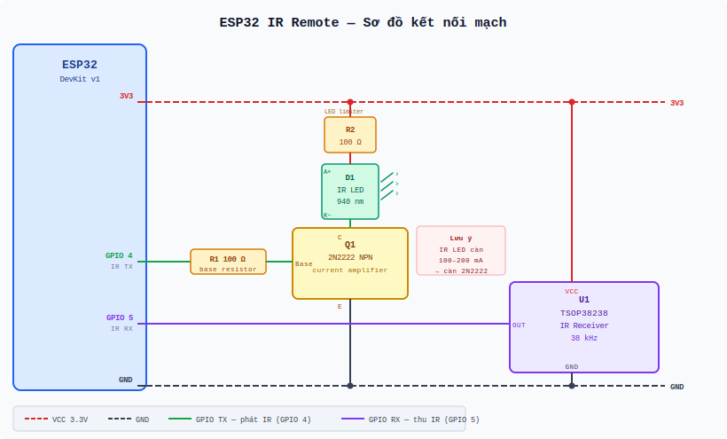

# ESP32 IR Remote

Biến ESP32 thành điều khiển hồng ngoại thông minh — điều khiển tivi, quạt, điều hòa cũ (không có WiFi, không có app) từ điện thoại qua trình duyệt web, không cần cài thêm app, không cần cloud.

---

## Bài toán giải quyết

Các thiết bị gia dụng đời cũ (TV, quạt trần, điều hòa) chỉ có điều khiển hồng ngoại vật lý. Khi muốn điều khiển từ xa qua điện thoại hoặc tích hợp vào hệ thống smart home, không có lựa chọn nào ngoài thay mới thiết bị.

**Giải pháp:** Gắn một module ESP32 nhỏ vào phòng. ESP32 kết nối WiFi nhà, phát tín hiệu hồng ngoại thay thế điều khiển gốc, và expose web UI + REST API để điện thoại trên cùng mạng điều khiển.

```
Điện thoại  →  WiFi nhà  →  ESP32  →  IR LED  →  Thiết bị
```

Thiết bị mới có thể thêm bất kỳ lúc nào bằng tính năng **học mã** — không cần nạp lại firmware.

---

## Tính năng

| Tính năng | Mô tả |
|---|---|
| Web UI | Giao diện điện thoại, không cần cài app |
| Điều khiển TV | Power, Vol+/−, Mute, Ch+/−, Source |
| Điều khiển quạt | Power, Tốc độ 1/2/3, Swing |
| Điều khiển điều hòa | Power, Nhiệt độ 16–30°C, Mode, Tốc độ quạt — hỗ trợ 50+ hãng |
| Học mã | Capture mã từ điều khiển gốc, lưu thẳng vào thiết bị — không cần reflash |
| Device Registry | Thêm thiết bị tùy ý, lưu mã vào Flash — sống sót qua mất điện |
| **Điều khiển giọng nói** | Nút 🎤 trên web UI — nói "bật đèn phòng ngủ", "tắt tivi" → gửi lệnh IR ngay |
| Cấu hình WiFi qua UI | Đổi SSID/mật khẩu WiFi ngay trên trình duyệt, không cần cáp USB |
| Raw send | Gửi bất kỳ mã IR nào qua API (NEC/Samsung/LG/Sony/RC5/RC6/Panasonic) |
| Local only | Không cloud, không tài khoản, hoạt động khi mất internet |

---

## Phần cứng sử dụng

| Linh kiện | Mô tả | Vai trò |
|---|---|---|
| **ESP32 DevKit v1** | Vi điều khiển WiFi/BT | Xử lý web server + phát IR |
| **IR LED 940nm** | LED hồng ngoại (vô hình mắt thường) | Phát tín hiệu điều khiển |
| **Transistor NPN 2N2222** | Khuếch đại dòng | GPIO ESP32 chỉ ~12mA, LED cần 100–200mA |
| **Điện trở 100Ω** | Giới hạn dòng vào base transistor | Bảo vệ GPIO |
| **TSOP38238** (hoặc tương đương) | IR receiver 38kHz | Thu tín hiệu từ điều khiển gốc (học mã) |

### Sơ đồ kết nối



```
3V3 ──[R2 100Ω]──[IR LED 940nm]──┐
                               Collector
GPIO 4 ──[R1 100Ω]── Base (2N2222)
                               Emitter ── GND

GPIO 5 ───────────────────── OUT (TSOP38238)
3V3  ─────────────────────── VCC (TSOP38238)
GND  ─────────────────────── GND (TSOP38238)
```

> **Tại sao cần transistor?**  
> GPIO của ESP32 tối đa ~12mA. IR LED cần 100–200mA để có tầm phát đủ xa (3–5m). Transistor 2N2222 đóng vai trò switch: GPIO kích base, collector kéo dòng lớn từ 3V3 qua LED.

### Tần số sóng mang

| Giao thức | Tần số | Thiết bị phổ biến |
|---|---|---|
| NEC / Samsung / LG / Panasonic | 38 kHz | TV, quạt, DVD |
| Sony SIRC | 40 kHz | TV Sony |
| RC5 / RC6 | 36 kHz | TV Philips |

---

## Kiến trúc phần mềm

```
src/
├── config.h    — WiFi fallback, GPIO pin, mã IR cứng cho TV/quạt/điều hòa
├── wifi_cfg.h  — Đọc/ghi credentials WiFi vào LittleFS (/wifi.json)
├── ir.h        — Wrapper IRsend / IRac / IRrecv
├── devices.h   — Device Registry: CRUD thiết bị tùy ý lưu trên LittleFS
├── html.h      — Web UI nhúng (single-page app, không cần file system riêng)
└── main.cpp    — WiFi init + WebServer routes
```

### Luồng hoạt động

```
setup()
  ├── wifiCfgLoad()         — đọc credentials từ Flash (nếu có)
  ├── WiFi.begin()          — kết nối WiFi (Flash > config.h fallback)
  ├── irSetup()             — khởi tạo IRsend (GPIO 4) + IRrecv (GPIO 5)
  └── server.begin()        — mở HTTP server port 80

loop()
  ├── server.handleClient() — xử lý HTTP request
  ├── irLearnPoll()         — polling không blocking cho chế độ học mã
  └── _pendingRestart check — restart sau khi lưu WiFi mới
```

**Ưu tiên WiFi credentials khi boot:**
```
/wifi.json trên Flash có dữ liệu  →  dùng (đã đổi qua web UI)
Không có                           →  fallback về WIFI_SSID / WIFI_PASSWORD trong config.h
```

### Device Registry

Danh sách thiết bị tùy ý được lưu trong `/devices.json` trên **LittleFS** (Flash của ESP32). Mỗi thiết bị chứa một map lệnh → mã IR:

```json
[
  {
    "id": "tv_phong_khach",
    "name": "TV Phòng Khách",
    "cmds": {
      "power":  { "label": "Bật / Tắt", "proto": "NEC", "code": "0xE0E040BF", "bits": 32 },
      "vol_up": { "label": "Vol +",     "proto": "NEC", "code": "0xE0E0E01F", "bits": 32 }
    }
  }
]
```

`label` là tên hiển thị trên nút bấm; `cmd` key là ID dùng trong API. Web UI tự sinh ID từ nhãn (ví dụ "Bật / Tắt" → `bat_tat`) — người dùng có thể sửa thủ công nếu muốn.

Dữ liệu sống sót qua mất điện, reboot, OTA. Thêm thiết bị mới hoàn toàn qua web UI — không cần reflash.

### Điểm kỹ thuật quan trọng

**GPIO routing sau IRac:** `IRsend` và `IRac` cùng dùng GPIO 4 nhưng qua hai RMT channel khác nhau. Sau khi `IRac.sendAc()` chạy, GPIO bị route sang channel của IRac. Mỗi lần gọi `irSendNEC()` phải gọi `_irsend.begin()` trước để route lại đúng channel.

**Non-blocking learn mode:** `IRrecv` polling trong `loop()` thay vì blocking wait. Web UI poll `GET /api/ir/learn` mỗi giây sau khi trigger `POST /api/ir/learn`.

**LittleFS auto-format:** `LittleFS.begin(true)` tự format nếu mount lỗi — ESP32 mới ra khỏi hộp không cần bước init thêm.

**WiFi config không reflash:** Credentials mới ghi vào `/wifi.json`, ESP32 tự restart. Lần boot sau `wifiCfgLoad()` đọc file này trước khi gọi `WiFi.begin()` — hoàn toàn độc lập với `config.h`.

**Điều khiển giọng nói (Web Speech API):** Nút 🎤 xuất hiện tự động nếu trình duyệt hỗ trợ `SpeechRecognition` (Chrome/Edge). Không cần backend mới — giọng nói được nhận diện trực tiếp trên máy/điện thoại rồi ánh xạ thành lệnh gửi tới API có sẵn. Hỗ trợ tiếng Việt (`vi-VN`). Cú pháp nhận: "bật [tên thiết bị]" / "tắt [tên thiết bị]" — tên khớp mờ với `name` hoặc `id` trong Device Registry. Lệnh ưu tiên: `on/off` → `power_on/power_off` → `power` → lệnh đầu tiên.

> **Lưu ý:** Chrome yêu cầu HTTPS hoặc `localhost` để dùng `SpeechRecognition`. Trên mạng nội bộ (`http://192.168.x.x`), Chrome Android thường chấp nhận vì địa chỉ private được coi là *potentially trustworthy*. Nếu nút 🎤 không hiện, mở trang qua HTTPS hoặc dùng Chrome trên máy tính.

---

## REST API

### Hệ thống

| Method | Endpoint | Mô tả |
|---|---|---|
| GET | `/` | Web UI |
| GET | `/api/status` | `{ ip, rssi, ssid, uptime }` |
| GET | `/api/wifi` | `{ ssid, ip }` — thông tin WiFi hiện tại |
| POST | `/api/wifi` | `{ "ssid":"...", "password":"..." }` — lưu & restart |

### IR cứng (TV / Quạt / Điều hòa)

| Method | Endpoint | Body |
|---|---|---|
| POST | `/api/ir` | `{ "device":"tv"\|"fan", "cmd":"power"\|... }` |
| GET | `/api/ir/ac` | Trả trạng thái AC hiện tại |
| POST | `/api/ir/ac` | `{ "power":true, "temp":25, "mode":"cool", "fan":"auto" }` |
| POST | `/api/ir/raw` | `{ "protocol":"NEC", "code":"0xE0E040BF", "bits":32 }` |
| POST | `/api/ir/learn` | Bắt đầu học mã → `{ "status":"listening" }` |
| GET | `/api/ir/learn` | `{ "done":false }` hoặc `{ "done":true, "protocol", "code", "bits" }` |

### Device Registry (thiết bị tùy ý)

| Method | Endpoint | Body / Mô tả |
|---|---|---|
| GET | `/api/devices` | Danh sách tất cả thiết bị |
| POST | `/api/devices` | `{ "id":"tv_phong_ngu", "name":"TV Phòng Ngủ" }` |
| DELETE | `/api/devices/:id` | Xóa thiết bị |
| POST | `/api/devices/:id/cmds` | `{ "cmd":"power", "label":"Bật / Tắt", "proto":"NEC", "code":"0x...", "bits":32 }` |
| POST | `/api/devices/:id/cmd/:cmd` | Gửi lệnh theo tên |

### Lệnh TV (`device: "tv"`)

`power` · `vol_up` · `vol_dn` · `mute` · `ch_up` · `ch_dn` · `source`

### Lệnh quạt (`device: "fan"`)

`power` · `spd1` · `spd2` · `spd3` · `swing`

### Điều hòa — mode & fan

| Trường | Giá trị hợp lệ |
|---|---|
| `mode` | `cool` · `heat` · `fan` · `dry` · `auto` |
| `fan` | `auto` · `low` · `med` · `high` |

---

## Cấu hình

### Lần đầu nạp firmware — chỉnh `src/config.h`

```cpp
// 1. WiFi fallback (dùng lần đầu; sau đó đổi qua web UI ⚙️ không cần reflash)
#define WIFI_SSID     "ten_wifi_nha_ban"
#define WIFI_PASSWORD "mat_khau_wifi"

// 2. Hãng điều hòa
#define AC_BRAND decode_type_t::DAIKIN
// Các hãng khác: MITSUBISHI_AC  PANASONIC_AC  LG  SAMSUNG_AC
//                GREE  TOSHIBA_AC  HITACHI_AC  CARRIER_AC  MIDEA ...

// 3. Mã IR cứng cho TV/quạt (hoặc bỏ qua — dùng Device Registry để học mã)
#define TV_POWER  0xE0E040BFUL
```

### Sau khi nạp — mọi thứ qua web UI, không cần USB

| Việc cần làm | Cách thực hiện |
|---|---|
| Đổi WiFi | Icon ⚙️ góc phải → nhập SSID + mật khẩu → Lưu |
| Thêm thiết bị mới | Tab **Thiết bị** → nhập ID + tên → + Thêm |
| Học lệnh IR | Tab **Học** → học mã → chọn thiết bị → Lưu |
| Điều khiển ngay | Chọn thiết bị trong tab Thiết bị → nhấn lệnh |

---

## Build & nạp firmware

```bash
# Build firmware
pio run -e esp32dev

# Nạp firmware (ESP32 cắm USB, cổng COM6)
pio run -e esp32dev --target upload

# Xem log Serial
pio device monitor --baud 115200
```

Sau khi boot, Serial in địa chỉ IP:

```
=== ESP32 IR Remote ===
Connecting to MyWiFi....
IP: 192.168.1.105  RSSI: -52dBm
[IR] TX=GPIO4  RX=GPIO5
Web UI: http://192.168.1.105
```

Mở địa chỉ đó trên điện thoại (cùng mạng WiFi).

### Thêm thiết bị mới (không reflash)

1. Mở web UI → tab **Thiết bị**
2. Nhập ID và tên → **+ Thêm**
3. Nhấn **+ Học lệnh** trong card thiết bị → nhập **Nhãn** (ví dụ: "Bật / Tắt") → ID tự điền → **Học**
4. Hướng remote gốc vào TSOP38238, nhấn nút cần học
5. Mã lưu vào Flash, xuất hiện ngay thành nút bấm (hiển thị nhãn) trong card

**Hoặc học mã trước, lưu vào thiết bị sau:**

1. Tab **Học** → **Bắt đầu học mã** → nhấn remote gốc
2. Kết quả hiện protocol/code/bits
3. Panel "Lưu vào thiết bị" tự mở → chọn thiết bị, nhập **Nhãn** + ID (tự điền) → **Lưu**

### Đổi WiFi (không reflash, không USB)

1. Nhấn icon **⚙️** góc phải header
2. Nhập SSID và mật khẩu WiFi mới
3. Nhấn **Lưu & khởi động lại ESP32**
4. Sau ~3 giây ESP32 restart, kết nối WiFi mới
5. Mở lại web UI tại IP mới (xem Serial hoặc router để biết IP)

---

## Thư viện

| Thư viện | Phiên bản | Mục đích |
|---|---|---|
| `crankyoldgit/IRremoteESP8266` | ^2.8.6 | Encode/decode 100+ giao thức IR |
| `bblanchon/ArduinoJson` | ^7.3.0 | Parse/serialize JSON cho REST API và LittleFS |
| `LittleFS` (built-in Arduino ESP32 2.x) | — | Lưu device registry (`/devices.json`) và WiFi config (`/wifi.json`) vào Flash |
| `WebServer` (built-in Arduino ESP32) | — | HTTP server |
| `WiFi` (built-in Arduino ESP32) | — | Kết nối WiFi |
